# SessionLens for VS Code — architecture and functional blocks

This document describes the whole extension as it stands at **v0.1.117**: what it is made of, how the parts talk
to each other, where data lives, and what each functional block does. It is written for developers who change the
code and for reviewers who need to know where to look.

It is the overview. Two other documents go deeper:

- [`RULES-ARCHITECTURE.md`](RULES-ARCHITECTURE.md) covers the check registry, the lint engines, calibration,
  the Rules tab, storage, the trust boundary and the VS Code integration line by line. This document links to its
  sections as **RA §N**.
- [`readme.md`](../readme.md) is the user guide: every tab, every setting and the full table of checks.

Contents

1. [What SessionLens does](#1-what-sessionlens-does)
2. [System context](#2-system-context)
3. [Code map](#3-code-map)
4. [Runtime structure](#4-runtime-structure)
5. [Data model](#5-data-model)
6. [Functional blocks](#6-functional-blocks)
7. [Security model](#7-security-model)
8. [Build, tests, CI and release](#8-build-tests-ci-and-release)
9. [How to extend](#9-how-to-extend)
10. [Known limits](#10-known-limits)

---

## 1. What SessionLens does

An AI coding agent (Claude Code, Codex) writes automated tests and says "all tests pass". SessionLens reads the
transcript of that session and shows what the agent actually did: tests that never ran, weakened assertions, fixed
sleeps, skipped triage, deleted tests, loosened configs and more. A reviewer confirms or rejects each finding. The
confirmed findings become rules for `CLAUDE.md` or `AGENTS.md`, and the verdicts calibrate the checks over time.

The core loop:

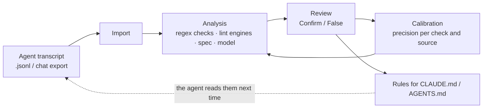

Everything runs locally. The only network traffic is the optional model review, sent to a provider the user chose
with the user's own key, or through the user's own Claude Code, Codex or Cursor CLI.

---

## 2. System context

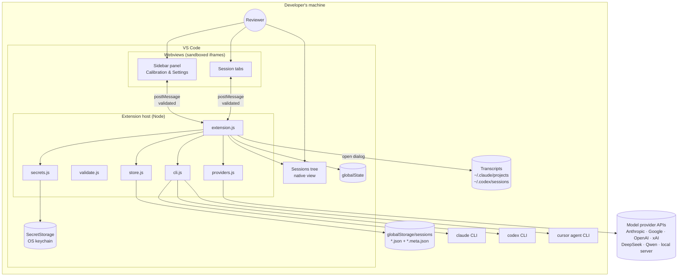

Who owns what:

| Concern | Owner | Why |
|---|---|---|
| Parsing transcripts, all checks, calibration, rendering | the webview | the analysis code is plain JavaScript shared with Node tests; the page needs no host round-trip to re-analyze |
| Session files, `globalState`, VS Code settings | the host | a webview has no file system and no settings API |
| API keys | the host, in SecretStorage | a key never enters a webview |
| HTTP calls to providers, CLI processes | the host | a webview cannot spawn processes; the host has no 300 s fetch limit and uses VS Code's proxy |
| Program paths and provider base URLs | the host's own configuration | never taken from a webview message (§7) |

---

## 3. Code map

```
extension.js          host: activation, views, commands, message handler, migrations, settings
store.js              host: sessions on disk (two files per session, atomic writes, repair)
validate.js           host: the check every webview message passes first
secrets.js            host: API keys in SecretStorage, migration out of settings
providers.js          host: HTTP transport to model providers (node:http/https)
cli.js                host: runs the user's claude / codex / cursor agent CLI with no tools, in an empty temp folder
package.json          manifest: views, commands, settings (package.nls.json holds the strings)

media/                everything the webview loads (also required by Node tests)
  checks.js           the check registry — the single source of truth for check names (RA §1)
  i18n.js             every UI string and rule text (English only)
  lens.js             import, profiles, regex checks, calibration, sorting, metrics, profileInfo
  lint.js             lint dispatcher: engines, rule maps, merge(), lazy loading (RA §6, §7)
  lint-java.js / lint-csharp.js / lint-python.js   tree-sitter engines (+ *.wasm)
  lint-robot.js       hand-written Robot Framework parser
  vendor-eslint*.js   prebuilt ESLint bundles: Playwright, Cypress, Detox rules (vendored, never edited)
  tree-sitter.js      web-tree-sitter runtime (vendored)
  rules.js            the rule book: text, severity, on/off; apply() of the user's overrides (RA §4)
  spec.js             specification parsing and coverage
  ai.js               model review: providers table, prompts, tasks, verify, queue
  segment.js          model-based segmentation of a session
  dialogs.js          in-page dialogs (the webview has no modal dialogs)
  demo-session.js     the made-up session behind "Try a demo session"
  vscode-bridge.js    the page side of the message bridge
  app.js              GENERATED from src/webview by `npm run build` — never edit by hand
  sidepanel.html, styles.css, icon.*

src/webview/          the panel's source, bundled by esbuild into media/app.js (RA §19)
  index.js main.js    entry, start-up, refresh
  sessions.js         Sessions tab: import, profile, demo, list
  review.js           a session's tab: findings, verdicts, spec, segmentation, timeline, coverage
  analysis.js         analyzeNow(): the analysis pipeline
  calibration.js      Calibration tab, exports, rules for CLAUDE.md / AGENTS.md, compress, skill
  rules.js            Rules tab
  prompts.js          Model rules tab
  settings.js         ⚙ Settings tab
  store.js            page side of storage: sessions, background pass, calibration stats
  common.js           helpers, theme

test/                 node --test: unit, DOM (jsdom + fake vscode), snapshots in test/__snapshots__
test-integration/     a real VS Code (@vscode/test-electron)
perf/                 performance runs and snapshot generators
scripts/              build-webview.js, check-vsix.js, release-notes.js
.github/workflows/    ci.yml (3 OS), release.yml (tag → Marketplace + Open VSX)
```

Layering. The arrows are "may depend on". Nothing in `media/` requires `vscode`; nothing in the host requires the
DOM. `lens.js`, `ai.js` and `i18n.js` are shared: the host loads them too (for summaries and the provider table).

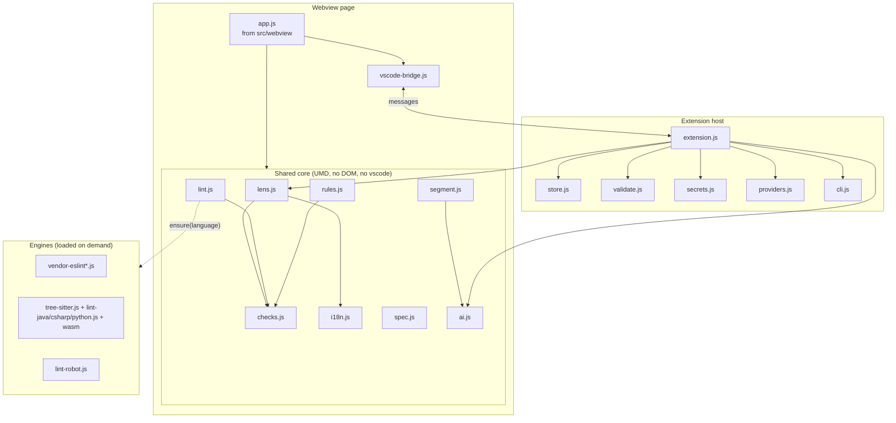

---

## 4. Runtime structure

### 4.1 Views

| View | Kind | What it shows |
|---|---|---|
| `sessionlensView` — "Calibration & Settings" | webview view in the SessionLens activity bar container | tabs **Sessions**, **Calibration**, **Rules**, **Model rules**, **⚙** |
| `sessionlensSessionsTree` — "Sessions" | native tree view | the stored sessions; Open, Rename, Delete; visible while the Sessions tab is active |
| `sessionlensSession` | webview panel, one per session | the review of one session: findings, verdicts, spec, timeline, coverage |

All three webviews load the same page (`sidepanel.html` + scripts); a session tab boots straight into its review
(the session id travels as a `data-` attribute on `<body>`). Session tabs are restored after a restart by
`SessionPanelSerializer`.

### 4.2 Activation

The extension activates when its view or a command is used, or when VS Code restores a session tab.

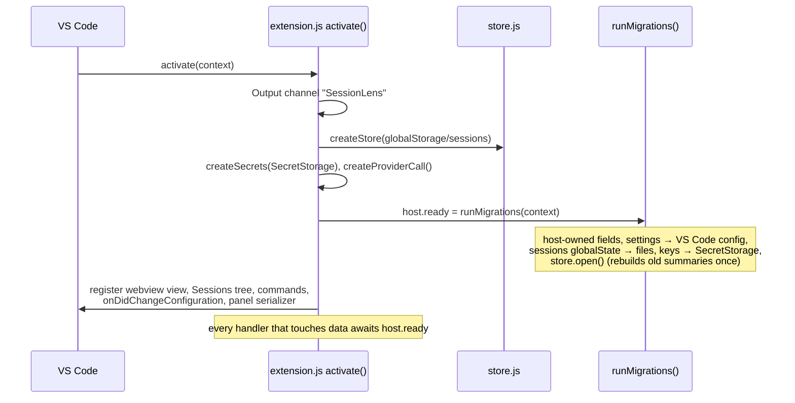

### 4.3 The message bridge

The page calls `call(type, payload)` in `vscode-bridge.js`; the host answers through `wireMessages()` in
`extension.js`. Every message is validated before anything else happens.

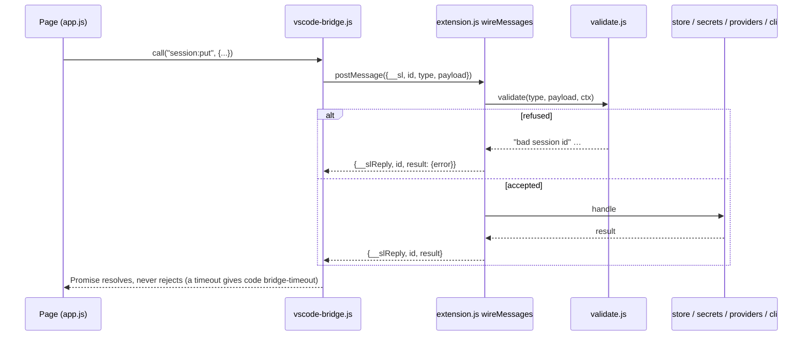

Message types (validated by `VALIDATORS` in `validate.js`):

| Group | Types |
|---|---|
| Lifecycle | `page:ready`, `panel:close`, `tab:active`, `log:timing` |
| Storage | `storage:get`, `storage:set` (only the keys in `STORAGE_KEYS`) |
| Sessions | `session:list`, `session:get`, `session:put`, `session:delete`, `session:clear`, `session:open` |
| Files and OS | `open:transcript`, `save:file`, `clipboard:write`, `settings:open` |
| Keys and addresses | `secret:set`, `secret:delete`, `secret:status`, `baseurl:set` |
| Model | `ai:call`, `claude:check`, `claude:run`, `codex:check`, `codex:run`, `cursor:check`, `cursor:run` |

When one page saves something, the host broadcasts a refresh (`broadcastRefresh`) to the other open pages, so the
sidebar and every session tab stay in step (RA §16.1).

---

## 5. Data model

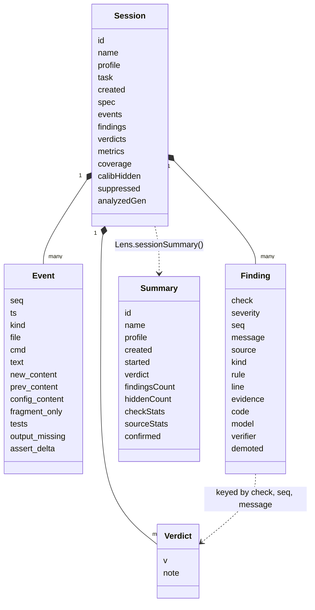

Values: `Event.kind` is one of `user`, `message`, `read`, `search`, `write`, `edit`, `delete`, `run_tests`,
`run_other`, `git`, `tool`; `Finding.severity` is `high`, `medium` or `low`; `Finding.source` is `formal`, `lint`,
`gherkin`, `spec` or `ai`; `Verdict.v` is `ok` (Confirm) or `fp` (False).

Key points:

- **Event.** One step of the transcript. `new_content` is the whole file as it stands after a write or an edit (a
  fragment only when the file was never seen whole: `fragment_only`). `prev_content` is the file as it was, kept for
  runner configs and test files so a first edit can be compared. `config_content` is the text of a runner config
  that is not code (`pytest.ini`, `pom.xml`, `build.gradle`, `.runsettings`…), kept away from the code checks.
  `ts` is the step's time from the transcript (empty for a claude.ai export). `output_missing` (0.1.121) marks a
  test run whose output the transcript does not keep (a Cursor import): its result is unknown, not red.
- **Finding.** `check` is the one key of the rules system (RA §1). `source` says which track made it; calibration
  is per check and source. `kind` is set on regex findings of the checks an engine may replace (RA §6.3). A model
  finding has `evidence`, and `model` / `verifier` (`provider/model`, since 0.1.115); an engine finding has `rule`,
  `line` and `code` (the lines around it).
- **Verdict key** is `check@seq@first 40 characters of the message`. Renaming a check detaches old verdicts: the
  CHANGELOG says so whenever it happens. A message a new version words differently keeps its verdict since 0.1.116:
  after each analysis `Lens.carryVerdicts` moves a verdict whose key matches no finding to the one finding of the
  same check and step that has none.
- **Summary** (`*.meta.json`) is what the sidebar, Calibration and Rules need without loading every session. The
  host computes it from the session (RA §15.1). Schema 3 (0.1.116) added `started`, the time of the first step with
  one, which the effect of a moved rule uses, and `hiddenCount`, the findings calibration hides, which the Sessions
  tree shows. `open()` rebuilds a summary of an older schema once.

---

## 6. Functional blocks

### 6.1 Import

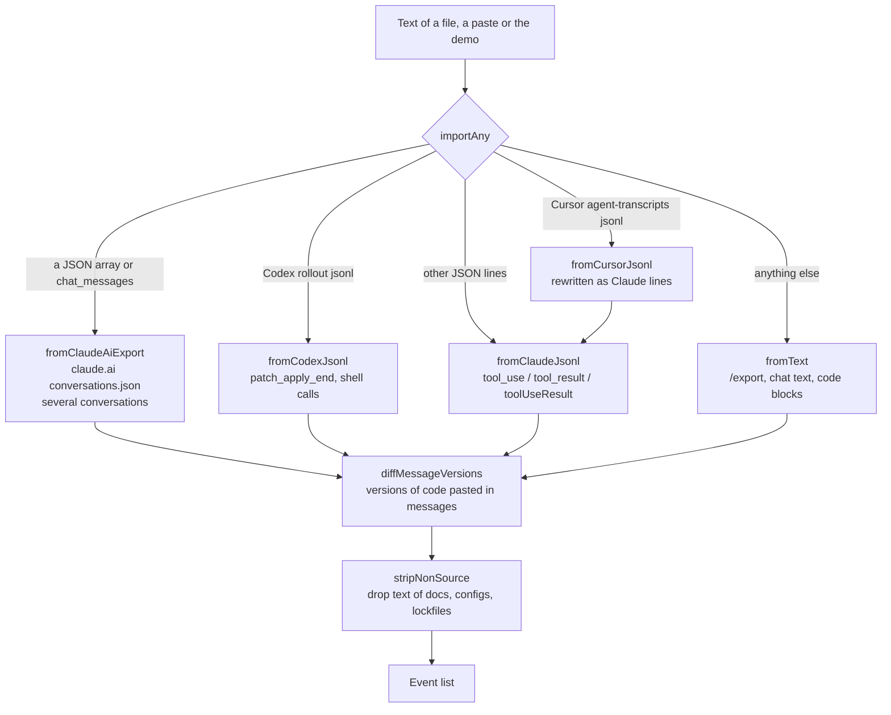

- **Claude Code `.jsonl`** is the richest source: each `Write`/`Edit` becomes an event with the whole file
  (rebuilt from `toolUseResult.originalFile` when the edit came as a fragment), each `Bash` call becomes
  `run_tests` (it matches the profile's runner) or `run_other`, and the runner's output is parsed into
  passed/failed counts by `runners.*` (pytest, jest/Playwright, JUnit, dotnet, go, newman, karate).
- **Codex `rollout-*.jsonl`** gives file changes as unified diffs (`patch_apply_end`), applied to the last known
  content; a deleted file becomes a `delete` event.
- **Cursor Agent `.jsonl`** (since 0.1.121; `~/.cursor/projects/<workspace>/agent-transcripts/<id>/<id>.jsonl`,
  from the IDE or the CLI) has `role` at the top of a line and tool calls without ids or results. `fromCursorJsonl`
  rewrites each line in the Claude Code shape (`Shell` → `Bash`, `StrReplace` → `Edit`, `path`/`contents` →
  `file_path`/`content`, `Glob`'s `target_directory` → `path`, `Delete` → a `delete` event), lets `fromClaudeJsonl`
  rebuild the files, then puts Cursor's tool names back. The user's `<user_query>` is the text and its
  `<timestamp>` the `ts`. A command's output is not in the file, so a test run gets `output_missing`, and
  `pass_claim_without_run` treats its result as unknown (not red, not absent). Cloud Agent runs leave no file.
- **claude.ai export and plain chat** carry code only inside messages; `diffMessageVersions` treats successive
  code blocks as versions of the same tests.
- **Secrets** are masked on export, in examples and, since 0.1.116, in every prompt sent to a model
  (`Lens.redactSecrets`, through `LensAI.maskSecrets` where each prompt is built and again in `callModel()`); a found
  secret is shown with its first four characters only.

### 6.2 Profiles

A profile (`Lens.PROFILES` in `lens.js`) tells every check what the code looks like: language, file extensions,
runner command patterns, source and test folders, the list of checks, and the patterns for sleeps, skips, focused
tests, debugging leftovers, weak assertions, test functions and assertion lines.

| Profile | Language / stack | Engine |
|---|---|---|
| `qa-ts` | TypeScript / JavaScript, Jest, Vitest, Playwright | ESLint (Playwright rules) |
| `qa-cypress` | Cypress | ESLint (Cypress rules) |
| `qa-detox` | Detox (React Native) | ESLint (own Detox rules) |
| `qa-python` | pytest | tree-sitter |
| `qa-java` | JUnit / TestNG (Java, Kotlin) | tree-sitter (`.java`) |
| `qa-c#` | xUnit, NUnit, MSTest | tree-sitter |
| `qa-api` | HTTP API tests in any stack, Postman, Karate | none |
| `qa-mobile` | Appium in any stack | none |
| `qa-robot` | Robot Framework | own parser |
| `qa-generic` | any language, process checks only | none |

`Lens.profileInfo()` builds the "What this profile checks" block from the profile, the registry and the rule maps,
so it never drifts from the code (RA §8.4).

### 6.3 Analysis pipeline

`analyzeNow(s)` in `src/webview/analysis.js` is the only place where all tracks meet (RA §3):

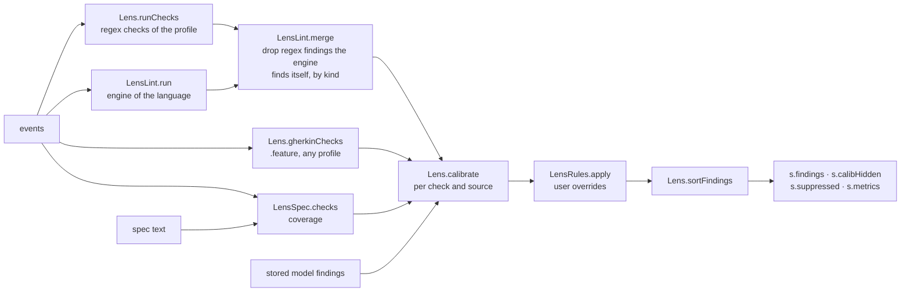

- The verdict of a session (Red, Yellow, Green) comes from the findings' severities (`Lens.verdict`).
- If the lint engine is still loading, the analysis is marked pending and redone when it is ready (RA §7).
- Re-analysis happens on import, on a spec change, after a rules change (debounced, open tabs first, the rest in a
  background pass), when an engine finishes loading, and after an update: `Lens.analysisGen` hashes the rule
  overrides, the ESLint switch, the calibration epoch and, since 0.1.116, `Lens.ANALYSIS_VERSION` (equal to the
  version in `package.json`), so a new version re-analyzes every stored session in the background.

### 6.4 Checks

61 checks in nine groups (Methodology, Process, Code, API, Mobile, Gherkin, Robot, Specification, Model). The
registry `media/checks.js` is the single source of truth; `test/rules-consistency.test.js` fails when a detector
emits a name that is not there, or a registry entry has no detector. The user-facing table is in the
[readme](../readme.md#the-checks); the developer table with sources is RA §9.

Five sources produce findings:

| Source | Where | Examples |
|---|---|---|
| `formal` (regex) | `checks` object in `lens.js` | `pass_claim_without_run`, `assert_weakened`, `test_deleted`, `config_weakened` |
| `lint` | an engine through `*_RULE_MAP` in `lint.js` | `raw_locator`, `no_assertion_after_action`, `focused_test` |
| `gherkin` | `Lens.gherkinChecks` | `scenario_no_then`, `outline_no_examples` |
| `spec` | `spec.js` | `no_spec`, `spec_uncovered`, `test_without_requirement` |
| `ai` | model review | `ai_purpose`, `ai_coverage`, `ai_missing` … |

Checks of what the agent did to the suite (v0.1.113) — `test_deleted`, `product_code_edited`,
`snapshot_overwritten`, `config_weakened` — compare file versions and commands across the session and turn high
right after a red run (RA §21).

### 6.5 Static analysis engines

`lint.js` is an engine-agnostic dispatcher (RA §6): every engine exposes `lint(code, {rules, filename})` and its
rule ids map to check names through one `*_RULE_MAP` per language.

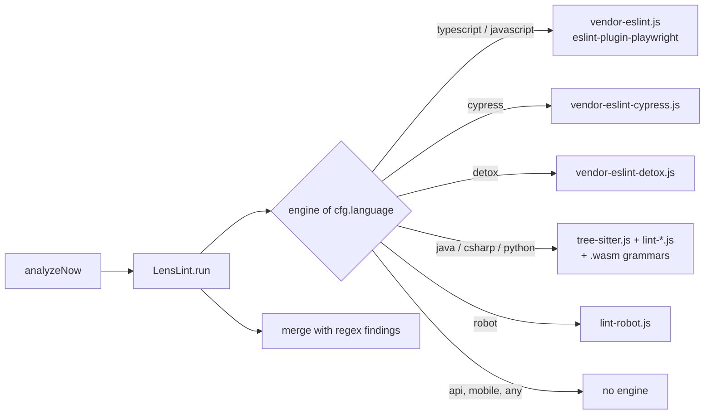

Engines load lazily (`LensLint.ensure`), only the files one language needs, with a 30 s timeout; a failed engine
leaves the regex findings in place and says so in the session (RA §7).

### 6.6 Specification and coverage

The reviewer pastes requirements (`R1. …`, `AUTH-142/R3 …`, an "Out of scope" part) on the session's tab.
`spec.js` parses them; `LensSpec.checks` finds the tests in the session's code (per language, RA §17) and links a
requirement to a test when the test's name, docstring, the comment above it or its first lines mention the ID.
Results: the coverage matrix on the tab and the `spec` findings. The model can segment the spec out of the
conversation (`segment.js`) when it was pasted into a message.

### 6.7 Model features

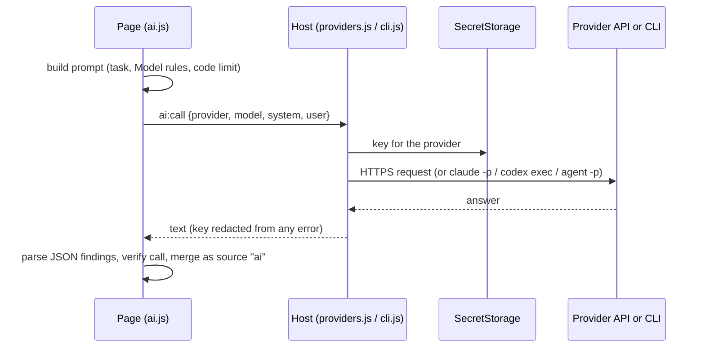

- **Providers** (`LensAI.PROVIDERS`): Anthropic, Google, OpenAI, xAI, DeepSeek, Qwen, a local OpenAI-compatible
  server, and the user's **Claude Code**, **Codex** or **Cursor** subscription through their CLI.
- **Tasks** (`TASKS`): `segment`, `review`, `verify`, `compress`, `skill`; each may use its own model.
- **Review** sends the session (chunked when large) and asks for findings in the same schema as the checks;
  **verify** asks a second call to keep only findings it can support with evidence (on by default). Since 0.1.115
  each model finding records `model` and, once verified, `verifier` (`provider/model`, `LensAI.modelLabel()`); the
  report and `verdicts.json` export them, for precision per model later.
- **What is sent:** each model button says it on hover (README, "Your data"). Since 0.1.116 every prompt has its
  secrets masked (`LensAI.maskSecrets`, which is `Lens.redactSecrets`) where it is built, and `callModel()` masks
  again; the verifier checks quotes against the masked text that was sent.
- **Pacing:** a queue with a minimum gap between requests and retries on HTTP 429 (`sessionlens.minGapMs`).
- **Model rules** tab: the prompts of each task are editable and exportable.
- **CLI safety:** `claude -p` runs with no tools, no MCP, no slash commands, in an empty temp folder, without
  session persistence; credentials are never read or forwarded (the header of `cli.js`; Windows specifics in
  RA §14.4).

### 6.8 Review and verdicts

A session's tab shows the header (verdict, profile, events, last result, metrics), the specification, the model
buttons, the findings with filters (source, severity, without verdict) and, per finding, a tag of its source,
**Confirm**, **False** and a comment. The tag (0.1.117) reads regex, gherkin, spec or model as the filter does; a
`lint` finding names the engine of the session's profile (eslint, tree-sitter or robot), while the filter and the
Calibration table say "lint". Verdicts are stored in the session under the finding's key. The tab also has the raw timeline (every event
with its `seq`, linked from the findings) and the coverage matrix.

Exports from the tab: **PR report (.md)** (only reviewed findings; high findings without a verdict block it) and
**Report .json** (an open schema, `reportObj`). Since 0.1.116 both include what calibration hides: Report .json as
`hiddenByCalibration` (with the precision that hid each one), the PR report as a section naming the hidden high
findings.

### 6.9 Calibration, rules and the Rules tab

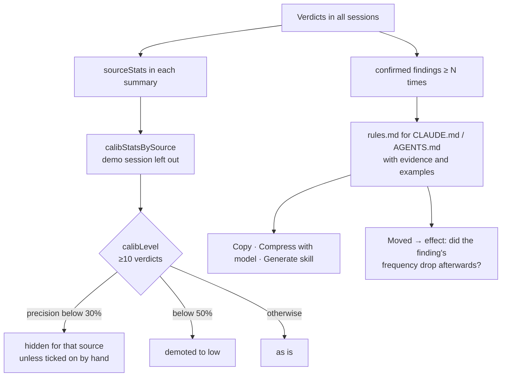

- **Calibration tab:** the precision table per check and source, the proposed rules, export and import of
  verdicts (`verdicts.json`, with the verdicts of hidden findings marked `hidden: true`; an import skips rows it
  already has), the calibration log (RA §5.2).
- **Never calibrated:** the model's findings, `no_spec` and `spec_uncovered`, imported findings, and a check the
  registry marks `calibrate: false` (`hardcoded_secret`, since 0.1.116).
- **Effect of a moved rule** (`effect()`): findings per session before and after the day the rule was marked
  Moved. A session counts by when the agent ran it (`started`, else `created`), only sessions of the profiles that
  can report the check count, and the demo never does (0.1.116).
- **Rules tab:** the rule book — wording, severity and on/off of every check, grouped like the registry; changes
  re-analyze the sessions; the book exports and imports as a diff (`rules.json`, RA §4). **Show checks for** narrows
  the list to one profile's checks (a view only, since 0.1.114).
- **Model rules tab:** the prompts of the model tasks.

### 6.10 Storage

| Data | Where | Notes |
|---|---|---|
| Sessions | `globalStorage/sessions/<name>.json` + `<name>.meta.json` | atomic write (temp file, rename), repair on open, retry on Windows locks (RA §15) |
| Settings of the page, rule overrides, calibration log, results of compress/skill | `globalState`, keys in `STORAGE_KEYS` | the page reads and writes only these keys |
| Seven user settings | VS Code configuration `sessionlens.*` | two-way sync with the ⚙ tab (RA §16.1) |
| API keys | SecretStorage | never in `globalState`, never in a webview (RA §14) |
| Local / Qwen base URLs | `globalState.hostBaseUrls`, written only by `baseurl:set` | the page cannot point the host at an address |

Migrations run once at activation (`runMigrations`): host-owned fields out of the page's settings, settings into
VS Code configuration, sessions from `globalState` into files, keys into SecretStorage, old summaries rebuilt.

### 6.11 Settings

`sessionlens.claudeCliPath`, `sessionlens.codexCliPath`, `sessionlens.cursorCliPath`, `sessionlens.minGapMs`, `sessionlens.maxCode`,
`sessionlens.verify`, `sessionlens.lint`, `sessionlens.rulesTarget`. The ⚙ tab edits the same values plus the
models per task, the keys, the local and Qwen addresses and the demo button. A change in `settings.json` reaches every open page.

### 6.12 Demo session

`media/demo-session.js` is a made-up Claude Code transcript with its specification: an agent writes Playwright tests
for a login page and makes the usual mistakes (11 findings, the same since v0.1.113). It is imported like a file, its verdicts are
left out of calibration, and `test/demo-session.test.js` pins its findings, so a check that changes them also
signals that the README screenshots need retaking.

---

## 7. Security model

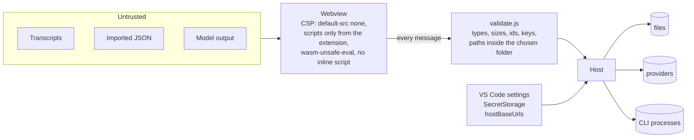

- The page renders untrusted text; everything is escaped (`esc()`), and `test/xss.test.js` renders hostile payloads
  in every view, with mutation tests that drop one `esc()` and expect to notice.
- The host treats each message as written by an attacker (`validate.js`): unknown types, wrong types and oversize
  payloads are refused; a session id never becomes a path; saved files stay inside the folder the user picked.
- Program paths and provider addresses never come from a message. Keys never leave the host; errors are redacted.
- The CLIs run without tools, so a transcript that says "run rm -rf" has nothing to run it with.

Details: RA §14.

---

## 8. Build, tests, CI and release

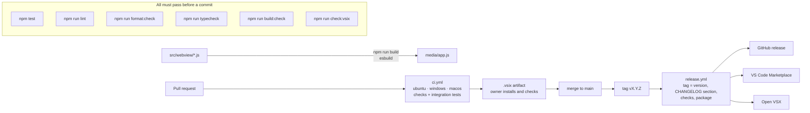

- **Unit and DOM tests** (`node --test`): the shared core runs in Node directly; the panel runs in jsdom with a
  fake `vscode`; the real ESLint and tree-sitter engines run in Node too.
- **Snapshots** (`test/__snapshots__`): rendered views, the rule book, profile details, lint output, calibration.
  They change only on purpose, in a commit of their own (`SL_UPDATE_SNAPSHOTS=1`).
- **Integration tests** (`npm run test:integration`): a real VS Code — activation, commands, view order, migrations
  on old data, a session tab, refusals of `validate.js`.
- **Packaging:** `check:vsix` compares the files `vsce` would package with an allow-list; sources, tests and docs
  stay out.
- No runtime dependencies: the bundles are vendored, the host uses only Node and VS Code APIs.

The test suite in detail (harnesses, what each file checks, how to update each snapshot, how to add a test) is in
[`TESTING.md`](TESTING.md).

---

## 9. How to extend

| To add | Touch | Guarded by |
|---|---|---|
| A check | `checks.js` entry → detector (`lens.js` regex, a `*_RULE_MAP`, `spec.js` or `ai.js`) → rule text in `i18n.js` → profile lists → readme table | `rules-consistency.test.js`, `supersedes.test.js`, `rule-mapping.test.js`, snapshots (RA §12) |
| An engine rule | the engine's `RULE_MAP`; `SAME_AS_REGEX` if it reports under a `SUPERSEDES` name | `supersedes.test.js` fails until the kind is decided |
| A profile | `PROFILES` in `lens.js` (+ `VISIBLE`), test extraction in `spec.js`, `profile_desc_*` in `i18n.js`, issue template list | `profile-info.test.js`, `issue-template.test.js`, snapshots |
| An engine | `ENGINES`, `ENGINE_FILES` and a rule map in `lint.js`; `ENGINE_SCRIPTS` in `extension.js`; `check:vsix` allow-list | `lazy-engines.test.js` |
| A message type | a row in `VALIDATORS` (`validate.js`) and a handler in `wireMessages` | `validate.test.js`, `trust-boundary.test.js` |
| A provider | `LensAI.PROVIDERS` (request shape in `ai.js`), keys and base URL handling follow from its flags | `providers.test.js`, `ai-transport.test.js` |
| A setting | `package.json` + `package.nls.json`, `CONFIG_SETTINGS` in `extension.js`, the ⚙ tab | `vscode-integration.test.js` |

Rules of the house (CLAUDE.md): one topic per pull request; a CHANGELOG line and a patch version for anything a
user can notice; snapshots updated only on purpose; no new runtime dependencies without a written reason.

---

## 10. Known limits

- **Regex checks are heuristics.** They read what the transcript shows; calibration exists because some will be
  wrong for a given team.
- **No engine** for qa-api, qa-mobile and qa-generic; Kotlin files in qa-java get regex checks only.
- **Fragments.** A file first seen as an edit fragment, with no `toolUseResult`, cannot be compared: deletions and
  loosened configs in it are not reported.
- **Stored sessions** keep the events they were imported with: findings that need `prev_content` or a Codex
  `delete` event appear only after the transcript is imported again (**Import again** in the session's tab, since
  0.1.114).
- **The model review** depends on the provider and the prompt; its precision is shown, never used to switch it off.
- **Secret masking works by pattern** (`Lens.redactSecrets`): a secret of an unusual shape can still reach a
  model or an export.
- **English UI only** (decided in 0.1.110); Russian stays only in the recognition patterns.
