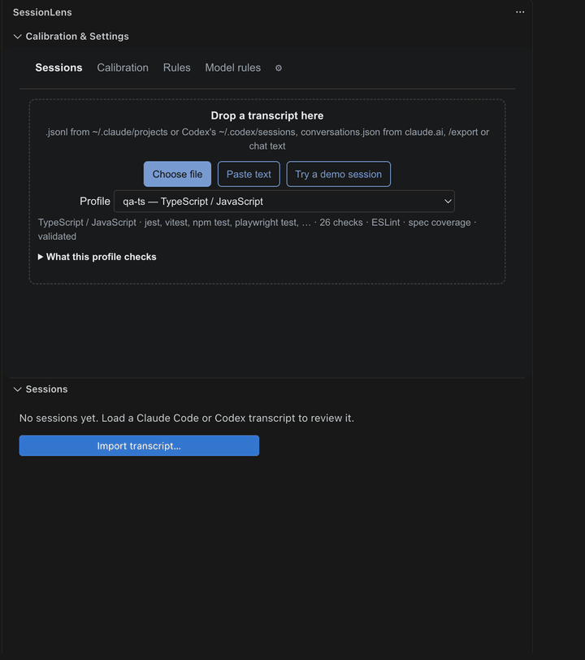
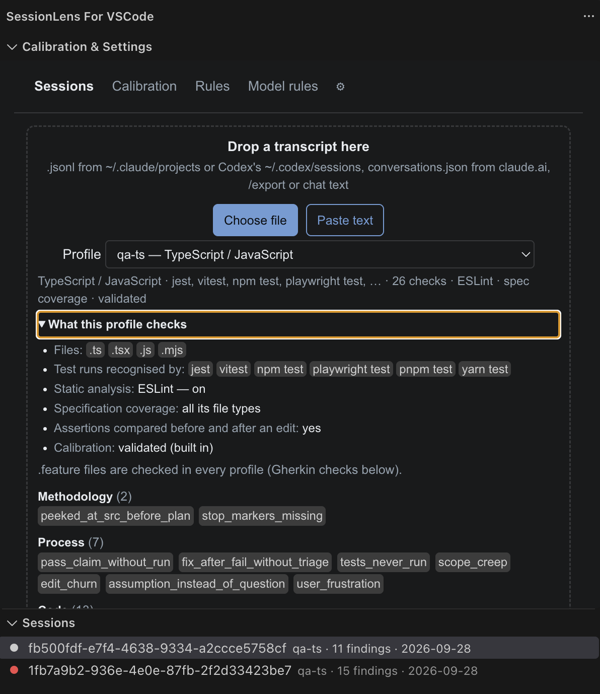
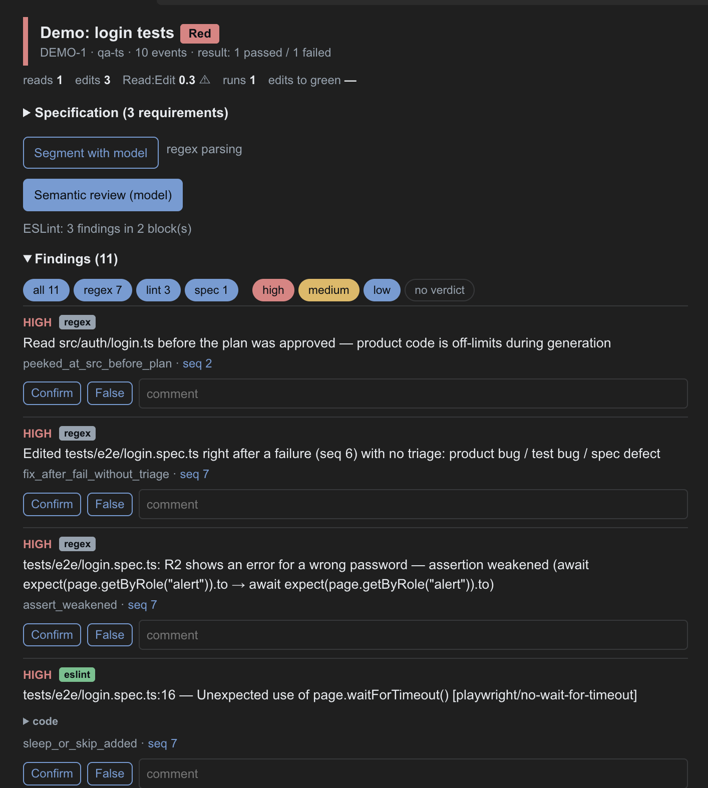
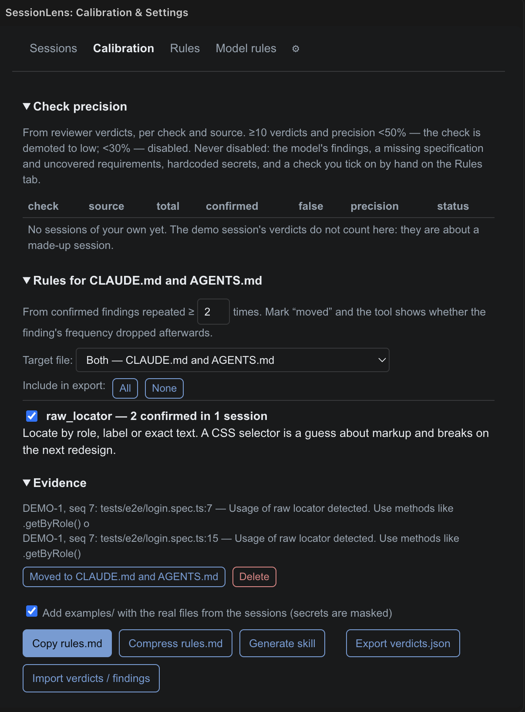
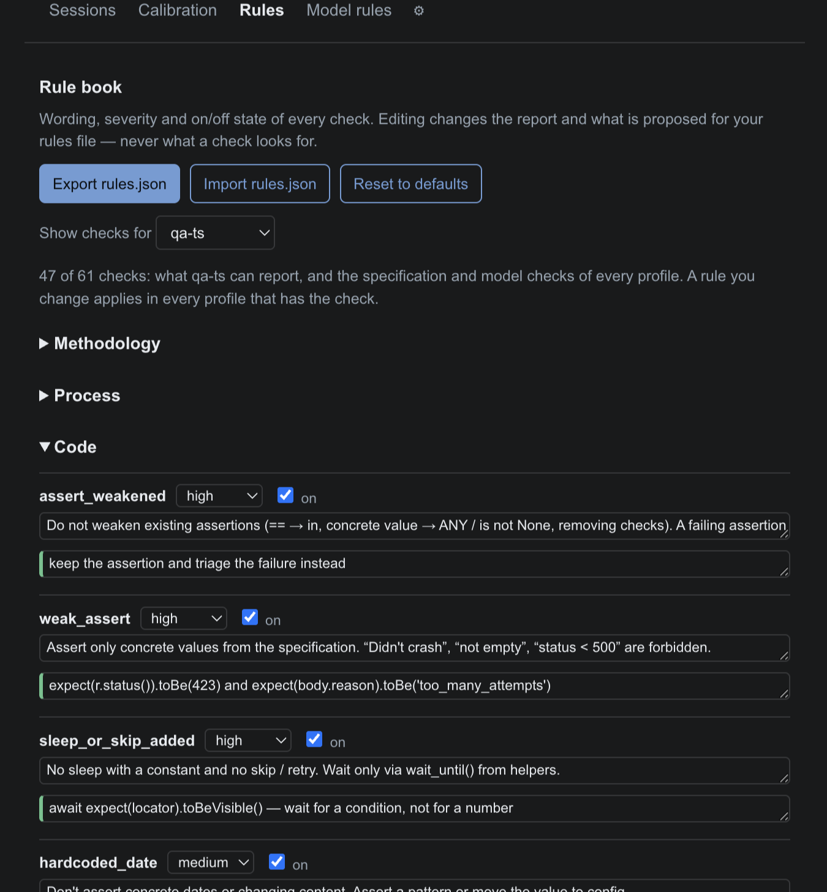

# SessionLens

SessionLens is built for QA automation (AQA) engineers who write autotests with Claude Code or Codex. It reviews what the agent actually did in a session: reads the transcript, flags where the agent went wrong, lets you record a verdict on each finding, and turns the findings you confirm into rules for `CLAUDE.md`, `AGENTS.md` (Codex's equivalent), or both.

It is built for sessions in which an agent writes or fixes automated tests, but the process checks work for any coding session.

> **SessionLens is experimental.** The checks are still being tuned, and your feedback is what turns them into a more
> useful tool. If a finding is wrong, a check is missing, or something is hard to use, please
> [open an issue](https://github.com/nikolaylosev/sessionlens-vscode/issues/new) (see
> [Found a false finding?](#found-a-false-finding) for what to include).



## Contents

- [Quick start](#quick-start)
- [How it works](#how-it-works)
- [The tabs](#the-tabs)
- [Rules: the rule book](#rules-the-rule-book)
- [Profiles](#profiles)
- [Testing APIs (`qa-api`)](#testing-apis-qa-api)
- [Gherkin (`.feature` files)](#gherkin-feature-files)
- [Model providers](#model-providers)
- [Commands and VS Code settings](#commands-and-vs-code-settings)
- [Install](#install)
- [Your data](#your-data)
- [Found a false finding?](#found-a-false-finding)

## Quick start

**Just want to see it first?** Open the panel and press **Try a demo session** on the Sessions tab. It opens a made-up
session in which an agent writes Playwright tests for a login page and makes the usual mistakes: it reads product
code before the plan, relaxes an assertion right after a failure instead of finding out why, adds a fixed wait and
retries, skips one requirement, and reports that all tests pass without running them again. Try **Confirm** on a
finding and see the rule it proposes on the **Calibration** tab. The demo's verdicts do not count for calibration;
delete the session when you are done.

1. **Open the panel.** Click the SessionLens icon in the Activity Bar, or run **SessionLens: Open panel** from the Command Palette. The sidebar has two parts: the **Calibration & Settings** panel with its own tabs on top, and a native **Sessions** list under it (hidden while another tab of the panel is open). If you moved these parts yourself earlier, VS Code keeps your order; drag a part by its title to change it. Most actions are also in the Command Palette, see [Commands and VS Code settings](#commands-and-vs-code-settings).
2. **Load a session.** On the **Sessions** tab of Calibration & Settings, pick a **Profile** that matches the code the agent was writing (for example `qa-ts`), then drop a transcript onto the panel, choose a file, or paste the text. It then shows up in the **Sessions** list below the panel.
3. **Open it.** Click the session in the **Sessions** list. It opens in its own editor tab, so several sessions can be open side by side, and closing one is just closing that tab.
4. **Add the specification (optional).** In the session's tab, open **Specification** and paste the requirements with IDs (`R1.`, `R2.` …). This enables coverage checks.
5. **Read the findings.** Every finding shows what happened and the evidence. Skim the **Timeline** too: a session with no findings is not necessarily a good one.
6. **Give a verdict.** Press **Confirm** if a finding is right or **False** if it is not. Add a comment if it helps.
7. **Turn confirmed findings into rules.** On the **Calibration** tab (back in Calibration & Settings), pick **Target file** — `CLAUDE.md`, `AGENTS.md` (Codex's equivalent) or both — copy the proposed rules in, and mark them **Moved**. SessionLens then shows whether that finding became less frequent in later sessions.

Optional: add a model in **⚙** to get a semantic review by a language model on top of the built-in checks.

## How it works

```
transcript ──▶ Sessions ──▶ Review ──▶ verdicts ──▶ Calibration ──▶ rules for CLAUDE.md / AGENTS.md
                              ▲                          │
                              └──── Rules tab ◀──────────┘
                        (wording, severity, on/off of each check)
```

- **Checks** look at the session and produce findings. Most are plain pattern checks that run instantly and offline. The optional model review and the static-analysis pass for `qa-ts`, `qa-cypress`, `qa-detox` (ESLint), `qa-java`/`qa-c#`/`qa-python` (tree-sitter) and `qa-robot` (a small hand-written parser) add more.
- **Verdicts** are yours. They are the ground truth SessionLens learns from.
- **Calibration** measures how often each check is right on your sessions and proposes rules from the findings you keep confirming.
- **Rules** is where you decide how each check is worded and how loudly it speaks.

A session's overall result is **Red** if it has any high-severity finding, **Yellow** if it has any medium-severity finding, and **Green** otherwise.

## The tabs

### Sessions

A native list, under the Calibration & Settings panel, of every session you have loaded. A colored dot shows its verdict (red/yellow/green); a ✓ replaces it once the session is marked reviewed. Click a session to open it in its own editor tab; right-click it for **Open**, **Rename…** and **Delete**. A session you renamed is shown under its new name everywhere (list, tab title, header); otherwise the task id found in the transcript is shown, with the file name under it. With no sessions yet, the list shows an **Import transcript…** button. The list is visible right after installing, while the **Sessions** tab below is open and while the panel below is collapsed; it is hidden while you're on Calibration, Rules, Model rules or Settings.

If you moved the two parts around in an earlier version, VS Code keeps your order.

The **Sessions** tab itself, inside Calibration & Settings, is where you load a transcript:



- **Accepted input:** Claude Code `.jsonl` (from `~/.claude/projects`), Codex `rollout-*.jsonl` (from `~/.codex/sessions`, CLI or the VS Code extension), a Cursor Agent `.jsonl` (from `~/.cursor/projects/<workspace>/agent-transcripts/`; the output of the agent's commands is read from Cursor's own databases on your machine, read-only, so test runs have their results), `conversations.json` from claude.ai, an `/export`, or plain chat text. A file with several conversations asks for part of a name to load only one. In the VS Code build, **Choose file** first asks whether the transcript is from Claude Code, Codex, Cursor Agent or somewhere else, then opens VS Code's own dialog straight inside `~/.claude/projects`, `~/.codex/sessions` or, for Cursor Agent, the open workspace's `~/.cursor/projects/<workspace>/agent-transcripts` (or `~/.cursor/projects` when that workspace has none) — all three are hidden by a leading dot (with no way to browse from one into another once you're inside), but everything one level below is a normal, visible folder or file.
- **Profile:** the language and test runner to analyse for. See [Profiles](#profiles).
- **Paste text:** paste a transcript, give it a name (for example `AUTH-142 Ivan`) and press **Analyse**.

A loaded session appears in the **Sessions** list below the panel — click it there to open it.

### Review



Everything about one session. It opens in its own editor tab when you click a session in the Sessions list, rather than being a tab inside Calibration & Settings, so several sessions can stay open side by side, next to the code the agent touched. Any session tabs still open reopen on their own the next time you start VS Code.

- **Header:** the verdict (Red, Yellow or Green), the profile, the number of events and the last test result. Below it are metrics: reads, edits, test runs and edits before the first green run.
- **Specification:** requirements with IDs, plus an optional "Out of scope" section. **Save and recompute** matches requirements to tests and adds coverage findings. Without a specification the first finding is "no specification".
- **Segment with model:** asks the model to label the transcript as prose, specification, plan, code or output. It helps most for chat text where the code lives inside messages. **Back to regex parsing** undoes it.
- **Semantic review (model):** the model looks for what patterns cannot: what a test really checks, coverage, fragility, missing cases. If **Verification call** is on in Settings, a second request drops every finding the model cannot back with a quote from the materials. Dropped ones are listed under **Dropped by verification**. The review and the verification are two separate requests — routed to different models, per **Model per request** in Settings, they can succeed or fail independently. If the review succeeds but verification does not (rate-limited, briefly overloaded, …), a **Verify again** button appears next to the status: it retries just that step on the findings already there, instead of re-running the whole review.
- **Findings:** filter by source (regex, lint, spec, model) or by "no verdict". Each finding is tagged with its source; a static-analysis finding with the engine that found it (eslint, tree-sitter or robot). Each finding has **Confirm** and **False** buttons and a comment box.
- **Model request and reply:** the exact prompts and answers of the session, downloadable as `.txt`. Each request is headed with the provider and model that really answered it, which matters once you choose a model per request in ⚙ Settings. Hidden unless **Debug model** is on in ⚙ Settings.
- **Timeline, Assertions, Transcript:** the sequence of reads, edits and test runs, a before-and-after comparison of assertions in each test, and the full conversation.
- **Export:** **PR report (.md)** copies a report with confirmed, rejected and undecided findings. It is blocked until every high-severity finding has a verdict. **Report .json** exports the same data in an open schema; a model finding there also names the model that found it (`model`) and the one that verified it (`verifier`). Findings that calibration hides are in both reports too: Report .json lists them under `hiddenByCalibration` with the precision that hid them, and the PR report names the hidden high-severity ones. The Sessions tree shows how many a session has ("2 hidden by calibration"), so a green session with hidden findings does not look clean.
- **Import again:** shown on a session imported before 0.1.113, which may miss deleted tests and loosened runner configs. It parses the transcript once more into the same session, keeping its name, specification and verdicts; if the transcript was too large to keep at import, you pick the file again.
- **Mark reviewed**, **Rename** and **Delete** manage the session itself. **Delete** also closes this tab, since there is nothing left to show in it.

### Calibration



Learning from your verdicts.

- **Check precision:** for every check and source (regex, lint, gherkin, spec, model, imported; lint is static analysis, whichever engine ran), how many findings you confirmed or rejected. A check with at least 10 verdicts for one source and precision below 50% is automatically demoted to low severity for that source. Below 30% it is switched off for that source. So when ESLint and a regex check report under the same name, for example `weak_assert`, a poor record of one never switches off the other.
  - **What is calibrated:** the regex checks, static analysis (ESLint, tree-sitter, Robot Framework), the Gherkin checks, and two specification checks that are guesses: `test_without_requirement` and `out_of_scope_tested`.
  - **What is never switched off,** marked **not calibrated** in the table with the reason on hover: the model's findings (their precision depends on the model and the prompt, not on the check; the table still shows it, so you can compare models and prompts), `no_spec` and `spec_uncovered` (facts, not guesses), `hardcoded_secret` (a missed token costs more than a false alarm; untick it on the Rules tab if you need to), and imported findings.
  - A switched-off check still runs: its findings are kept out of sight and its verdicts keep counting, so it stays off until you decide otherwise. The line **Disabled for low precision** under a session's findings names each one with its source.
  - **To bring one back,** tick it on the **Rules** tab. A check you tick on there is never switched off by calibration, and the table and the Rules tab mark it **on by hand**.
- **Rules for CLAUDE.md/AGENTS.md:** a rule appears once the same check has been confirmed at least N times (2 by default, editable). For each one you see the evidence from your sessions. **Target file** picks which of the two the export, Compress rules.md and Generate skill features are worded for — `CLAUDE.md` (Claude Code), `AGENTS.md` (Codex and other agents that read it), or both.
  - **Moved** marks a rule as applied to the chosen target file(s). From then on SessionLens compares how often that finding occurred per session before and after. A session counts by when the agent ran it (the time of the transcript's first step; the import time when the transcript has none), only sessions of the profiles that can report the finding count, and the demo session never does.
  - **Delete** hides a rule from the proposals. Confirmed findings are kept, and **Restore hidden rules** brings them back.
- **Copy rules.md** copies all proposals (or the ones you selected with **Include in export**) as Markdown. Each rule has the wording, a "Not like this" snippet taken from a real session, and a "Like this" example.
- **Compress rules.md** (model) turns the proposals into one short numbered policy with ❌ and ✅ examples.
- **Generate skill** (model) turns confirmed rules into an Agent Skill package: `SKILL.md`, patterns and antipatterns, and an optional check script — the same `SKILL.md` shape Claude Code reads from `.claude/skills/` and Codex reads from `.codex/skills/`. **Save to folder…** writes it under `skills/<name>/` inside the folder you pick (point it at your project root). Both this and **Compress rules.md** also show a one-line **Suggested CLAUDE.md / AGENTS.md text** — add that single line to your entry-point file(s) instead of pasting the rules into each; both agents read a plain instruction like this the same way, so one shared file works for both.
- Every **Compress rules.md** and **Generate skill** run is kept, newest first, below the buttons — with its own **Delete** (and, for a skill, **Save to folder…**). Unlike the raw request/reply log below, these stay until you delete them yourself.
  - **`examples/`** is added from your own sessions and is not written by the model: for each rule whose finding sits in a whole file, up to two of the real files the agent wrote (one per session first), exactly as written, with an `examples/README.md` that says which session and finding each file comes from. Secrets (tokens, keys, literal passwords) are replaced with `[REDACTED]`, but read the files before you share the skill, because they are real code from your work. Rules about process have no file and get no example. Untick **Add examples/** to leave the folder out; the model then never hears about it.
- **Model request and reply** (appears after the first request from this tab, and only while **Debug model** is on in ⚙ Settings): the exact prompt and the model's answer for each **Compress rules.md** and **Generate skill** request, newest first, failed calls included, with the provider and model that answered. The last 6 are kept, so you can still read them after reopening VS Code. **Copy**, **Download .txt** and **Clear** are below the log. **Delete everything** in Settings also removes it.
- **Export verdicts.json / Import verdicts / findings** move your verdicts between machines, including the ones on findings calibration hides (`"hidden": true`); a row already imported is skipped (a verdict on a model finding also names its `model` and `verifier`), and import findings from other tools (a JSON array with a `session` field). Imported findings show in the precision table under the source they name (**imported** if none); calibration never switches them off.

### Rules



The rule book. See [the next section](#rules-the-rule-book).

### Model rules

The instructions SessionLens sends to the model, one editable box each:

| Prompt | Used for |
|---|---|
| Segmentation | Labelling transcript lines as prose, spec, plan, code or output |
| Segmentation — local model | Same, for a local provider |
| Semantic review | Finding what regex checks cannot |
| Verification | Keeping only findings the model can quote from the materials |
| Semantic review — local model | Used for a local provider: one request per file, shorter, with an example |
| Compress rules.md | Producing the short numbered policy |
| Generate skill | Producing the Agent Skill package |

Only the instruction part is editable. The specification, code and transcript are appended automatically. Leave a box empty to use the built-in text, or press **Reset to built-in**. Changes are used on the next run.

### ⚙ Settings

- The panel's own dark/light look always follows VS Code's active color theme automatically — the sidebar's native Sessions list can only ever do the same, so there is no separate toggle for it here. SessionLens is in English whatever VS Code's display language: the panel, the Sessions list, the commands, the dialogs and notifications, and the descriptions in Settings. Russian in transcripts is still understood.
- **Models:** configure one or more models first, then choose which one answers which request — the two are separate steps. **Add a model** picks a provider (Anthropic, Claude Code, OpenAI, Google, xAI, DeepSeek, Qwen or a local server), its API key (not needed for Claude Code or a local server) and a model name, then adds it to the list below. A saved key is never shown again: the field only says **saved ✓** or **not set**. Leave it empty to keep the saved key, type a new one to replace it, or use **Delete key**. One model is the **default** (shown with that label); **Make default** switches it, **Remove** deletes one — anything routed to a removed model falls back to the default.
- **Model per request:** for each kind of request — segmentation, semantic review, verification, Compress rules.md and Generate skill — pick one of your configured models, or leave it on **Default (…)** to use the default model. For example, a cheap model for segmentation, the strongest one for the review, and Claude Code for the skill. If the model that would answer a request has no key, SessionLens says so before it sends anything. If only the verification model is missing one, the review still completes and the findings are kept unverified.
- **Minimum gap between requests**, **Code limit in the prompt**, **Verification call** and **Static analysis** (and **Target file** on the Calibration tab) are also VS Code settings, see [Commands and VS Code settings](#commands-and-vs-code-settings). A change in either place shows up in the other.
- **Minimum gap between requests:** in milliseconds. The default 6500 keeps you under the free Gemini limit of about 10 requests a minute. Rate-limit errors are retried automatically.
- **Code limit in the prompt:** how many characters of code are sent to the model (40000 by default). Lower it for small local models.
- **Verification call:** on by default. It doubles the number of requests and makes model findings noticeably more precise.
- **Static analysis:** on by default. `qa-ts` (ESLint via eslint-plugin-playwright), `qa-cypress` (ESLint via eslint-plugin-cypress), `qa-detox` (ESLint, hand-authored rules — see [Detox](#detox-only-for-the-qa-detox-profile)), `qa-java`/`qa-c#`/`qa-python` (a real parse tree via tree-sitter, also hand-authored — see [Java](#java-only-for-the-qa-java-profile), [C#](#c-only-for-the-qa-c-profile), [Python](#python-only-for-the-qa-python-profile)), and `qa-robot` (a small hand-written parser — see [Robot Framework](#robot-framework-only-for-the-qa-robot-profile)). Each engine is loaded the first time a session of its profile is analyzed, and only in the page that analyzes it (a session tab, or the sidebar during an import); until then the finding list says "static analysis: engine loading…". With static analysis off, nothing is loaded.
- **Hide the "Try a demo session" button:** off by default. Tick it once you have sessions of your own and no longer need the demo on the Sessions tab. It applies at once; a demo session you already opened stays in the list until you delete it.
- **Debug model:** off by default. Turn it on to see **Model request and reply** — the exact prompt sent to the model and its raw reply — in a session (below Transcript) and on the Calibration tab. It's meant for troubleshooting a request, not everyday use: the prompts include the session's code and transcript excerpts.
- **Reset settings:** **Reset settings to defaults** puts every setting on this page back to what a fresh install has: theme (it follows VS Code again), all configured models and their keys, the model per request, the local server and Qwen addresses, request pacing, code limit, ESLint, verification, the debug model toggle and the Hide the "Try a demo session" button checkbox. The four VS Code settings above are set back to their defaults too. It asks for confirmation first, because saved keys are removed. Sessions, verdicts, rule wording, prompts and the profile are kept. The Claude Code, Codex and Cursor CLI paths are VS Code settings and are not changed.
- **Danger zone:** **Delete everything** removes all sessions and calibration history. Settings and rule wording are kept.

## Rules: the rule book

The **Rules** tab lists every check SessionLens can raise, with the rule an agent should follow to avoid it. The same rules are what the Calibration tab proposes for `CLAUDE.md`/`AGENTS.md`, so this tab is where you make them sound like your team.

**Show checks for** picks whose checks the list shows: by default the profile chosen on the Sessions tab, or **All profiles**. A profile's list has what it can report plus the specification and model checks, which every profile has. It only changes the view: a rule you edit applies in every profile that has the check, and export and **Reset** cover all of them.

### What you can change

For each check you can edit four things:

| Field | What it does |
|---|---|
| **Rule** | The wording, as the agent should read it. Used in reports and in `rules.md`. |
| **Good example** | The right way, in one line of code or one step. It becomes the "Like this" part of an exported rule. |
| **Severity** | High, medium or low. This decides whether a finding turns the session Red, Yellow or Green. While calibration has demoted the check to low, a severity you set here does not apply to its findings; an ⓘ next to it says so. |
| **On / off** | A check that is off is dropped from every session and report. A check you tick on here stays on even if calibration would switch it off; it is marked **on by hand**. |

Edited checks carry an **edited** mark. Changes apply at once: every session is re-analysed, so the header verdicts update.

Editing **never changes what a check looks for**. It changes wording, loudness and whether the check speaks at all.

### Sharing the rule book

- **Export rules.json** saves your edits (schema `sessionlens/rules@1`). Keep the file in your repository so the whole team uses the same wording and severities.
- **Import rules.json** loads such a file.
- **Reset to defaults** discards every edit.

### The checks

Checks are grouped as the tab shows them. "Default" is the built-in severity.

**Methodology**

| Check | Default | Raised when |
|---|---|---|
| `peeked_at_src_before_plan` | High | The agent read product code before the plan was approved |
| `stop_markers_missing` | Medium | Code was written without a plan, or a plan was produced without stopping for approval |

**Process**

| Check | Default | Raised when |
|---|---|---|
| `pass_claim_without_run` | High | The agent says tests pass with no test run before it, or while the last run was red |
| `fix_after_fail_without_triage` | High | The agent edits right after a failure without saying whether it is a product bug, a test bug or a spec defect |
| `tests_never_run` | High | Tests were written but never executed |
| `scope_creep` | Medium | A file was edited that is not in the plan |
| `edit_churn` | Medium | The same file was edited over and over |
| `assumption_instead_of_question` | Medium | The agent assumed ("I assume", "presumably") instead of asking |
| `user_frustration` | Medium | The user corrected the agent or repeated a request |
| `product_code_edited` | High | The agent changed product code (a file in the profile's source folders) in a testing task. High right after a failing run, medium otherwise. Tests, fixtures, page objects, mocks, a runner's config and a file named in the approved plan do not count |
| `snapshot_overwritten` | High | Snapshots were rewritten instead of read: a run with `-u`, `--update-snapshots`, `--snapshot-update` or `UPDATE_SNAPSHOTS=1`, or a snapshot or baseline file (`__snapshots__`, `*.snap`, `*-snapshots/`, `*.approved.*`, `*.verified.*`) written by hand. High right after a failing run, medium otherwise |
| `config_weakened` | High | The test runner's config was loosened compared with its previous version: more retries, a longer timeout, tests excluded (`testIgnore`, `testPathIgnorePatterns`, `--deselect`, surefire `<excludes>`, Gradle `excludeTestsMatching`, `TestCaseFilter` …) or failures ignored (`testFailureIgnore`, `skipTests`, `ignoreFailures`). Reads JS/TS configs, pytest's files, Maven's surefire and failsafe, Gradle's test tasks and `.runsettings`. High right after a failing run, medium otherwise. A config written for the first time counts only for its retries |

**Code**

| Check | Default | Raised when |
|---|---|---|
| `assert_weakened` | High | An existing assertion was made weaker, or assertions were removed |
| `weak_assert` | High | An assertion only checks "didn't crash" instead of a value |
| `sleep_or_skip_added` | High | A fixed sleep, a skipped test (`skip`, `@Disabled`, `[Ignore]`) or a retry on a test (`@flaky`, `[Retry]`, `describe.configure({ retries })`) was added. Retries in the runner's config are `config_weakened` |
| `hardcoded_date` | Medium | A date is asserted and will break when content changes |
| `fragile_wait` | Medium | The test depends on timing or page internals: `networkidle` waits, exact element counts, `force: true`, element handles, `eval`, waits without a timeout |
| `expected_failure` | Medium | Tests marked as expected failures (`xfail`, `test.fail()`) keep the suite green while a bug is open |
| `magic_number` | Low | Unexplained numbers in assertions |
| `assertion_roulette` | Low | Several assertions with no messages, so a failure does not say which one |
| `conditional_logic` | Low | An `if` or loop inside a test |
| `duplicate_assert` | Low | The same assertion repeated |
| `raw_locator` | Low | A raw CSS selector instead of a role, label or text locator |
| `positional_locator` | Low | Selection by position, such as `.first()` or `.nth()` |
| `no_assertion_after_action` | High | A test has no assertion at all (Playwright, via ESLint `expect-expect`; the other languages in their sections below) |
| `lint_valid_title` | Low | A Playwright test or `describe` title is empty, not a string, or starts or ends with a space (ESLint `valid-title`) |
| `focused_test` | High | `.only`, `fit` or `fdescribe` was left in a test, so only it runs and the rest of the suite is silently skipped (TypeScript, Cypress, Detox, API and mobile profiles) |
| `debug_leftover` | Medium | Debugging was left in a test: `page.pause()`, `cy.pause()`, `cy.debug()`, `debugger`, `breakpoint()`, `pdb.set_trace()` |
| `cypress_async_test` | Medium | An `async` test or hook in Cypress, where the commands may not run (`qa-cypress`, via ESLint) |
| `test_deleted` | High | A test was removed from a file, or a test file was deleted (`rm`, `git rm`, a Codex patch). High right after a failing run, medium otherwise. A test renamed with the same body, moved to another file or restored later does not count |
| `hardcoded_secret` | High | A token, key or credential is written in the code. The report shows only its first four characters (TypeScript, Cypress, Detox, API and mobile profiles) |
| `hardcoded_base_url` | Medium | A real host is written in a test instead of coming from configuration. A runner's config file, where the base URL belongs, does not count (same profiles) |

**API** (only for the `qa-api` profile)

| Check | Default | Raised when |
|---|---|---|
| `status_only_assert` | Medium | A test checks the status code and nothing else, so an empty body or an error page passes |
| `mocked_service` | Medium | The HTTP calls are mocked (`responses`, `nock`, WireMock, MockHttp …), so the test may be checking the mock and not the service |
| `no_negative_cases` | Medium | Two or more API tests were written and none checks an error response |
| `test_data_no_cleanup` | Low | A test creates data with `POST` and nothing removes it |
| `response_time_assert` | Low | A functional test asserts a response-time limit |

**Mobile** (only for the `qa-mobile` profile)

| Check | Default | Raised when |
|---|---|---|
| `mobile_raw_locator` | Low | An element is located by XPath or class name instead of accessibility id / resource-id |
| `hardcoded_coordinates` | Medium | A tap, swipe or long-press uses a literal screen coordinate instead of acting on the element |
| `no_driver_teardown` | Medium | A driver session is created with no matching `quit()`/teardown found in the same file |

**Detox** (only for the `qa-detox` profile, via ESLint static analysis — hand-authored rules, since `eslint-plugin-detox` has none)

| Check | Default | Raised when |
|---|---|---|
| `sleep_or_skip_added` | High | A fixed delay (`setTimeout`, incl. as a `new Promise` sleep) is used instead of `waitFor(...).withTimeout(...)` |
| `fragile_wait` | Medium | A `waitFor(...)` chain ends in a visibility/existence check with no `.withTimeout(...)` — Detox's default wait is very short |
| `positional_locator` | Low | `.atIndex(n)` is used to disambiguate a matcher instead of a stable `by.id(...)` |
| `no_assertion_after_action` | High | A test taps, types or swipes but has no `expect(...)` anywhere — nothing is actually verified |
| `no_app_reset` | Medium | A `describe` block has tests but no `beforeEach(device.reloadReactNative())` / `launchApp({ newInstance: true })` — app state can leak between tests |

**Java** (only for the `qa-java` profile, via a real parse tree — [tree-sitter](https://tree-sitter.github.io/), not ESLint — since Java isn't JavaScript; hand-authored rules, as no existing JUnit/TestNG rule set was available to bundle)

| Check | Default | Raised when |
|---|---|---|
| `unannotated_test_method` | High | A method named like a test (`test…`, in a class named `…Test`/`…Tests`/`…IT`) has no `@Test` or other JUnit/TestNG lifecycle annotation — the runner silently never calls it |
| `no_assertion_after_action` | High | A `@Test` method calls other code but has no `assert*(...)` anywhere — nothing is actually verified (same check as Detox's, different language underneath) |
| `swallowed_exception` | High | An empty (or comment-only) `catch` block — an exception here is silently swallowed and the test passes regardless |
| `assert_args_reversed` | Medium | `assertEquals(actualValue, 200)` — the literal usually goes first (expected), the value under test second; this reads reversed. Only the unambiguous 2-argument form is checked |

Applies to `.java` files only — `.kt` (Kotlin) files in the same profile are not parsed by this grammar and simply produce no tree-sitter findings; the language-agnostic checks (sleeps, skips, weak assertions) still apply to them as before.

**C#** (only for the `qa-c#` profile, via tree-sitter, same recipe as Java — same four checks, same meaning, NUnit/xUnit/MSTest attributes instead of JUnit/TestNG annotations)

| Check | Default | Raised when |
|---|---|---|
| `unannotated_test_method` | High | A method named like a test, in a class named `…Test`/`…Tests`, has none of `[Test]`/`[Fact]`/`[TestMethod]`/lifecycle attributes — the runner silently never calls it |
| `no_assertion_after_action` | High | A `[Test]`/`[Fact]`/`[TestMethod]` method calls other code but has no `Assert.*`/`.Should()` anywhere — nothing is actually verified |
| `swallowed_exception` | High | An empty (or comment-only) `catch` block |
| `assert_args_reversed` | Medium | `Assert.AreEqual(actualValue, 200)` or `Assert.Equal(actualValue, 200)` — the literal usually goes first (expected). Only the unambiguous 2-argument form is checked |

**Python** (only for the `qa-python` profile, via tree-sitter — three of the four Java/C# checks, since pytest's name-based test discovery has no missing-annotation smell to detect, and a plain `assert a == b` has no argument order to get backwards)

| Check | Default | Raised when |
|---|---|---|
| `no_assertion_after_action` | High | A `test_…` function or method calls other code but has no `assert` statement, `assert*(...)` call, or `with pytest.raises(...)`/`with pytest.warns(...)` anywhere — nothing is actually verified. Functions decorated `@pytest.fixture` are never checked, even if named `test_…` |
| `swallowed_exception` | High | An `except:` block whose body is only `pass` or `...` |
| `assert_args_reversed` | Medium | unittest-style `self.assertEqual(actualValue, 5)` — the literal usually goes first. Does not apply to a plain `assert` statement, which has no fixed argument order |

**Robot Framework** (only for the `qa-robot` profile, via a small hand-written parser — Robot's tabular, keyword-driven syntax is not a general-purpose language, and no usable tree-sitter grammar was found: the one that exists is a small, ~2-month-old, single-maintainer package built with an incompatible WASM ABI, which would mean bundling a whole second tree-sitter runtime just for it)

| Check | Default | Raised when |
|---|---|---|
| `empty_test_case` | High | A test case has no steps at all — a stub nobody filled in |
| `no_assertion_after_action` | High | A test case has steps but none of them is a `Should */Must *` keyword — nothing is actually verified |
| `sleep_or_skip_added` | High | A step calls `Sleep` (a fixed delay) or `Skip`/`Skip If` |
| `duplicate_step_text` | Low | Two or more test cases in the same file have the exact same sequence of steps — same lower-confidence hint as Gherkin's version; a single shared setup step (e.g. `Open Browser`) repeating across many tests is normal and does not trigger this |

**Specification** (needs a specification on the Review tab)

| Check | Default | Raised when |
|---|---|---|
| `no_spec` | High | There is no specification, so requirements and guesses cannot be told apart |
| `spec_uncovered` | High | A requirement has no test |
| `test_without_requirement` | Medium | A test references no requirement |
| `out_of_scope_tested` | Medium | Something marked out of scope is tested |

Coverage links a requirement to a test when the test's name, the comment above it, its docstring or its first lines mention the requirement's ID (`R1`, `AUTH-142/R3`). Tests are found in TypeScript/JavaScript (`it`, `test`: also in qa-cypress and qa-detox), Python (`def test_…`), Java (`@Test void …`), Kotlin (`@Test fun …`, also names in backticks), C# (`[Test]`, `[Fact]`, `[Theory]`, `[TestMethod]`, `[TestCase]`), Go (`func Test…`), Karate/Gherkin (`Scenario:`) and Robot Framework (`*** Test Cases ***` and `*** Tasks ***`; `[Documentation]` and `[Tags]` count). qa-api, qa-mobile and qa-generic pick the syntax by the file's extension. Files SessionLens cannot read tests from (for example `.swift`, `.resource`) do not count: if a session has only such files, coverage is not computed and no `spec_uncovered` is raised. The profile's details under **Profile** show which file types count.

**Model findings** (from the semantic review)

`ai_purpose` (what a test really checks), `ai_coverage`, `ai_fragility`, `ai_missing` (a missing case), `ai_questions` (a question should have been asked instead of assuming), `ai_fix_justification` and `ai_spec_defect`.

Language-specific checks (sleeps, skips, weak assertions, test names) use the patterns of the selected [profile](#profiles).

## Profiles

Under the **Profile** list on the Sessions tab, a line sums up what the selected profile checks, and **What this profile checks** lists it in full: file types, which test runs it recognises, its checks by group (a check switched off in Rules is struck through), static analysis and whether it is on, which file types count for specification coverage, whether assertions are compared before and after an edit, and the calibration status. Everything there is read from the same data the analysis uses. The profile name in a session's header shows the same summary as a tooltip.

Choose the profile that matches the code the agent was writing:

| Profile | Language and runner |
|---|---|
| `qa-ts` | TypeScript / JavaScript, Jest, Vitest, Playwright (also runs ESLint static analysis) |
| `qa-cypress` | TypeScript / JavaScript, Cypress (also runs ESLint static analysis via eslint-plugin-cypress) |
| `qa-detox` | TypeScript / JavaScript, Detox (React Native e2e) — also runs ESLint static analysis via our own Detox rules |
| `qa-python` | Python, pytest (also runs tree-sitter static analysis — see [Python](#python-only-for-the-qa-python-profile)) |
| `qa-java` | Java / Kotlin, JUnit (also runs tree-sitter static analysis on `.java` files — see [Java](#java-only-for-the-qa-java-profile)) |
| `qa-c#` | C#, xUnit, NUnit, MSTest (`dotnet test`) (also runs tree-sitter static analysis — see [C#](#c-only-for-the-qa-c-profile)) |
| `qa-api` | API tests in any common stack, with checks specific to HTTP APIs. See [Testing APIs](#testing-apis-qa-api) |
| `qa-mobile` | Appium tests in any common stack (Java, Python, TypeScript/JavaScript, C#) — locator strategy, gesture coordinates, driver teardown |
| `qa-robot` | Robot Framework (`.robot`/`.resource`) — also runs its own structural checks (no tree-sitter grammar — see [Robot Framework](#robot-framework-only-for-the-qa-robot-profile)) |
| `qa-generic` | Any language, process checks only |

Profiles marked as unvalidated have fewer than five recorded verdicts, so treat their code findings as hints.

## Testing APIs (`qa-api`)

Choose **`qa-api`** when the agent was writing tests for an HTTP API. API tests are written in many stacks, so this profile is not tied to one language.

**What it understands**

| Stack | Tests recognised |
|---|---|
| Python | pytest with `requests`, `httpx` |
| Java / Kotlin | JUnit or TestNG with REST Assured |
| TypeScript / JavaScript | Jest, Vitest, Playwright with Supertest, axios, `fetch` or Playwright's request context |
| C# | xUnit, NUnit, MSTest with `HttpClient` or RestSharp |
| Go | `go test` |
| Postman | `pm.test(...)` scripts inside `*.postman_collection.json` |
| Karate | `.feature` files (`Scenario:`) |

It also reads the result of `pytest`, `jest`, `vitest`, `mvn test`, `dotnet test`, `go test`, `newman` and `karate` runs, so "tests pass" claims are checked against the real output.

**What is checked**

1. **Everything `qa-generic` and the language profiles check.** Process and methodology (claiming tests pass without running them, fixing without triage, scope creep …) and the code checks (weakened assertions, added sleeps and skips, weak assertions such as `status < 500` …).
2. **The API group** in the table above, plus `hardcoded_secret` and `hardcoded_base_url` from the Code group. These are the mistakes agents make most often when the thing under test is an API: asserting only the status, mocking the service they should be calling, leaving tokens and hosts in the code, testing only the happy path, and leaving test data behind.
3. **Specification coverage.** Paste requirements with IDs (`R1. POST /users creates a user`) and name the ID in each test, as with any other profile. A requirement with no test becomes a finding.

**Typical session**

1. Ask the agent to write the tests, and load the transcript with the `qa-api` profile.
2. Read the findings. `hardcoded_secret` and a `stop_markers_missing` or `pass_claim_without_run` finding are worth acting on first.
3. Confirm or reject each one. Because the API checks are new, they start uncalibrated: after ten verdicts on a check, one that is wrong more than half the time is demoted automatically, and below 30% it is switched off.
4. Turn the confirmed findings into rules for `CLAUDE.md` (or `AGENTS.md`, for a Codex project) on the Calibration tab. Edit the wording of the API rules on the Rules tab so they name your own base URL variable and auth fixture.

**Good to know**

- The API checks are pattern-based and are marked *unvalidated* until you have recorded five verdicts on this profile. Expect some false positives, especially for `test_data_no_cleanup` (not every `POST` creates data) and `mocked_service` (mocking a downstream dependency is fine).
- A secret is never printed in full: findings and reports show the first four characters and the length.
- JSON and YAML files are not scanned as code, except Postman collections and environments. OpenAPI documents are not read yet, so coverage is by requirement ID, not by endpoint.
- Bruno, Insomnia and `.http` files are not recognised.
- The `newman` and `karate` result parsers follow the summary formats those tools document. If a run of yours is not picked up, send a sample of its output.

## Gherkin (`.feature` files)

Cucumber-JVM, SpecFlow, behave and Karate all write the same Gherkin syntax, so the four checks below are **profile-agnostic**: they run on every `.feature` file the session touches, whatever profile you picked for the rest of the code (`qa-java`, `qa-c#`, `qa-python`, `qa-api`, or anything else). You do not need `qa-api` just to get feature-file checks.

| Check | Default | Raised when |
|---|---|---|
| `outline_no_examples` | High | A `Scenario Outline` has no `Examples:` table, or an empty one — it never actually runs with real data |
| `scenario_no_then` | High | A scenario has no `Then` step — nothing in it is actually verified |
| `bloated_background` | Medium | `Background` has more than 6 steps — a lot for every scenario in the file to share, and a common source of hidden coupling |
| `duplicate_step_text` | Low | Two or more scenarios in the same file have the exact same set of steps — a hint that one is a copy of the other, or that both belong in a single Scenario Outline |

`duplicate_step_text` is lower-confidence by design: it only fires on an exact match of the full step set, not a single shared `Given` (which is normal Gherkin style — many scenarios legitimately share a step like "Given the user is logged in").

## Model providers

Semantic review, segmentation, compression and skill generation are optional and use your own API key. Open **⚙** to add one of these as a model:

- Anthropic (Claude), with an API key
- Claude Code (your Claude subscription, no API key). See [below](#using-your-claude-subscription-no-api-key)
- Codex (your ChatGPT/Codex subscription, no API key). See [below](#using-your-codex-subscription-no-api-key)
- Cursor (your Cursor subscription, no API key). See [below](#using-your-cursor-subscription-no-api-key)
- Google (Gemini)
- OpenAI (GPT)
- xAI (Grok)
- DeepSeek
- Qwen (Alibaba Cloud). The key and the server URL must belong to the same region.
- Local (experimental): any OpenAI-compatible server, such as Ollama or LM Studio. The default `qwen2.5-coder:14b` is likely too small for useful findings; Qwen2.5-Coder-32B (Qwen2.5-32B) or Qwen2.5-72B is the recommended minimum.

API keys are kept in VS Code's secret storage (your OS keychain), not in the extension's settings, and never reach the panel. Requests to these providers are made by the extension itself, not by the panel, which adds the key on its way out. A request to a cloud API is stopped after 10 minutes without a reply. A local server has no time limit, since a large model on a CPU can take longer than that.

### Local servers

- **Address.** `http://localhost:11434/v1` is Ollama on this machine. A server elsewhere in your network or on a rented machine works too: enter its address (for example `http://192.168.1.20:11434/v1`). VS Code asks you to confirm any address other than the default before it is used; the same goes for a Qwen address, and if a Qwen key is saved the dialog says it will be sent there. Since the request is made by VS Code itself rather than a web page, the server does not need CORS settings. Ollama has no password of its own, so do not open its port to the internet: reach a remote server through an SSH tunnel (`ssh -L 11435:localhost:11434 server`, then `http://localhost:11435/v1`) or a VPN.
- **Remote windows.** In VS Code over SSH, WSL or a Dev Container the extension runs on the remote side, and so do its requests: `localhost` there is the remote machine, not yours. Run the server on the remote side, forward your own port to it (for SSH: `RemoteForward 11434 localhost:11434` in `~/.ssh/config`), or enter an address the remote machine can reach (for a Dev Container on Docker Desktop, `http://host.docker.internal:11434/v1`). When a local server cannot be reached from a remote window, the error says so. Requests to cloud providers also go out from the remote machine there, so it needs internet access.

### Using your Claude subscription (no API key)

If you have a Claude plan (Pro, Max, Team or Enterprise) but no API key, choose **Claude Code (subscription)** as the provider. SessionLens then runs the Claude Code you already have installed, in its non-interactive `claude -p` mode, and reads the answer.

**Set up**

1. Install Claude Code and sign in once in a terminal: `claude auth login`.
2. In SessionLens, open **⚙** and, under **Add a model**, choose **Claude Code (subscription)** as the provider. Press **Check Claude Code** — it reports the version and whether you are signed in.
3. Enter a model (`sonnet` by default; `opus`, `haiku` or a full model name also work) and press **Add model**. It becomes the default model if it's the first one you've added, and you can point any request at it under **Model per request**.

SessionLens finds `claude` itself, including the usual install folders that a VS Code started from the Dock or the Start menu does not have on its PATH. Only if it is installed somewhere unusual, set its full path in the VS Code setting `sessionlens.claudeCliPath` (the **Open settings** button in Add a model goes there). It is a machine setting: a project's `.vscode/settings.json` cannot change it, so opening someone else's repository cannot make SessionLens start a different program.

**How it stays safe**

- Your login is never read, copied or sent anywhere by SessionLens. The `claude` command signs itself in.
- Every request runs with all tools switched off, with no MCP servers and no skills, in an empty temporary folder. A transcript that contains "now delete the repository" therefore has nothing to act with, and no project `CLAUDE.md`, `.mcp.json` or hooks are picked up.
- The prompt goes through standard input, not the command line, and nothing is saved to Claude Code's session history.

**What to know**

- **Usage limits.** Requests count against your plan. A full review makes several requests (segmentation, semantic review, verification), so turn **Verification call** off in Settings if you want to spend less. At the time of writing, Anthropic's Help Center says that `claude -p` usage draws from the subscription's usage limits. It announced a separate monthly credit for this kind of use and then paused it, so check [the current policy](https://support.claude.com/en/articles/15036540-use-the-claude-agent-sdk-with-your-claude-plan).
- **Terms.** Anthropic's [legal and compliance page](https://code.claude.com/docs/en/legal-and-compliance) says a subscription sign-in is for ordinary use of Claude Code and does not allow routing requests through your plan on behalf of other people. Use this option for your own reviews, and read that page before you share the extension.
- **`ANTHROPIC_API_KEY`.** If this variable is set, Claude Code bills that key instead of your plan. **Check Claude Code** warns you when it is set.
- **Speed.** Each request starts a `claude` process, so expect a few seconds per request, and requests run one at a time. A rate-limit message means your plan's limit is reached: wait for it to reset.
- **Your own Claude Code settings.** Settings in `~/.claude` (a personal `CLAUDE.md`, hooks) can still be loaded by the CLI. If reviews look odd, try `claude --safe-mode` in a terminal to see whether a personal customization is the cause.
- **Remote windows.** In VS Code over SSH, WSL or a Dev Container the extension runs on the remote side, so Claude Code must be installed and signed in there.

### Using your Codex subscription (no API key)

If you have a ChatGPT plan that includes Codex, or a Codex API key already signed in to the CLI, choose **Codex (subscription)** as the provider. SessionLens then runs the Codex CLI you already have installed, in its non-interactive `codex exec -` mode, and reads the answer.

**Set up**

1. Install the Codex CLI and sign in once in a terminal: `codex login`.
2. In SessionLens, open **⚙** and, under **Add a model**, choose **Codex (subscription)** as the provider. Press **Check Codex CLI** — it reports the version and whether you are signed in.
3. Leave the model empty to use Codex's own default, or enter a full model name (for example `gpt-5.1-codex`), and press **Add model**. It becomes the default model if it's the first one you've added, and you can point any request at it under **Model per request**.

SessionLens finds `codex` itself. This works whether you installed the standalone CLI (`npm install -g @openai/codex` or Homebrew) or only the **Codex** VS Code extension (marketplace id `openai.chatgpt`) — that extension doesn't put `codex` on your system PATH, but it does carry its own copy inside its extension folder (`~/.vscode/extensions/openai.chatgpt-*/bin/<platform>/codex`, or `~/.vscode-server/extensions/...` for SSH/WSL/Dev Containers), and SessionLens looks there too. Set a full path in the VS Code setting `sessionlens.codexCliPath` only if none of this finds it — for example a non-default install location, or a VS Code fork this doesn't know to check.

**How it stays safe**

- Your login is never read, copied or sent anywhere by SessionLens. The `codex` command signs itself in.
- Every request runs in Codex's `read-only` sandbox, in an empty temporary folder. A transcript that contains "now delete the repository" therefore has nothing to act with.
- The prompt goes through standard input, not the command line, and `--ephemeral` keeps it out of Codex's own session history.

**What to know**

- **Usage limits.** Requests count against your plan. A full review makes several requests (segmentation, semantic review, verification), so turn **Verification call** off in Settings if you want to spend less.
- **`CODEX_API_KEY` / `OPENAI_API_KEY`.** If either is set, Codex may bill that key instead of your plan. **Check Codex CLI** warns you when one is set.
- **Speed.** Each request starts a `codex` process, so expect a few seconds per request, and requests run one at a time.
- **Remote windows.** In VS Code over SSH, WSL or a Dev Container the extension runs on the remote side, so the Codex CLI must be installed and signed in there.

### Using your Cursor subscription (no API key)

If you have a Cursor plan, choose **Cursor (subscription)** as the provider. SessionLens then runs the Cursor Agent CLI you have installed, in its non-interactive `agent -p` mode, and reads the answer. The Cursor editor itself is not needed, and the CLI is a separate install.

**Set up**

1. Install the Cursor Agent CLI and sign in once in a terminal: `curl https://cursor.com/install -fsS | bash`, then `agent login`.
2. In SessionLens, open **⚙** and, under **Add a model**, choose **Cursor (subscription)** as the provider. Press **Check Cursor CLI**: it reports the version and whether you are signed in.
3. Leave the model empty to use Cursor's own default (`auto`), or enter a model name from `agent --list-models`, and press **Add model**.

SessionLens finds `agent` in `~/.local/bin`, where the installer puts it. Set a full path in the VS Code setting `sessionlens.cursorCliPath` only if it is somewhere else. Windows was not tested yet.

**How it stays safe**

- Your login is never read, copied or sent anywhere by SessionLens. The `agent` command signs itself in.
- Cursor's CLI has no switch that turns its tools off: in `-p` mode it can read files, write files and run commands. So every request runs in Cursor's read-only `ask` mode, in an empty temporary folder that also holds a `.cursor/cli.json` denying every shell command, file read, file write, web fetch and MCP tool. A deny there wins over anything your own Cursor settings allow. Checked on CLI 2026.10.01: with the ask mode alone, a request could still read a file outside the folder by its full path and list another folder; with the deny list, both were refused.
- The prompt goes through standard input, not the command line.
- Cursor keeps a copy of every request, including the full prompt, under `~/.cursor/chats/` and `~/.cursor/projects/`, and has no switch against it. After each answer SessionLens deletes the copy of that one request: the folders named after its own temporary folder, and nothing else in `~/.cursor`. If it cannot, the **SessionLens** Output channel says so.

**What to know**

- **Usage limits.** Requests count against your plan. Cursor adds its own instructions to each request (about 8,500 tokens), so a request costs more than its text. A full review makes several requests, so turn **Verification call** off in Settings if you want to spend less.
- **`CURSOR_API_KEY`.** If it is set, the CLI signs in with that key, which may belong to another account. **Check Cursor CLI** warns you when it is set.
- **Speed.** Each request starts an `agent` process, so expect about ten seconds per request, and requests run one at a time. After a request, the CLI leaves a small background process running for a few minutes; it exits by itself.
- **Remote windows.** In VS Code over SSH, WSL or a Dev Container the Cursor CLI must be installed and signed in on the remote side.

## Commands and VS Code settings

**Command Palette** (all start with **SessionLens:**):

- **Open panel** — shows the sidebar.
- **Import transcript…** — shows the sidebar's Sessions tab and starts the same import as **Choose file**.
- **Open session…** — pick a session by name, profile or date; it opens in its own tab.
- **Export verdicts** — the same as **Export verdicts.json** on the Calibration tab.
- **Open settings** — VS Code Settings, filtered to this extension.

**Settings** (Settings → Extensions → SessionLens, or `sessionlens.*` in `settings.json`):

| Setting | Same as | Default |
|---|---|---|
| `sessionlens.minGapMs` | ⚙ Minimum gap between requests | 6500 (a local server: 0) |
| `sessionlens.maxCode` | ⚙ Code limit in the prompt | 40000 (a local server: 12000) |
| `sessionlens.verify` | ⚙ Verification call | on |
| `sessionlens.lint` | ⚙ Static analysis | on |
| `sessionlens.rulesTarget` | Calibration → Target file | `claude` |
| `sessionlens.claudeCliPath`, `sessionlens.codexCliPath`, `sessionlens.cursorCliPath` | path to the `claude` / `codex` / `agent` command | found automatically |

The first five are user settings: Settings Sync carries them to your other machines, and a project's
`.vscode/settings.json` cannot change them. The CLI paths are machine settings and are not synced. Values you had set
in the panel before 0.1.103 are moved into these settings on the first start.

The **SessionLens** Output channel lists migrations, CLI failures and how long each analysis took. It never contains
transcript text, prompts, model replies or keys.

## Install

From the Visual Studio Marketplace: search for **SessionLens** in the Extensions view, or run
`code --install-extension nikolaylosev.sessionlens-vscode`.

From a `.vsix` file (each [GitHub release](https://github.com/nikolaylosev/sessionlens-vscode/releases) has one):

1. Open the Extensions view in VS Code.
2. Click **⋯** at the top of the view and choose **Install from VSIX…**.
3. Select the `.vsix` file and reload the window if VS Code asks.

To build it from source, see [CONTRIBUTING.md](CONTRIBUTING.md).

## Your data

Everything stays on your machine, in VS Code's storage for this extension (ID `nikolaylosev.sessionlens-vscode`):

- **Sessions** are files in the extension's global storage folder, `globalStorage/nikolaylosev.sessionlens-vscode/sessions/`
  inside your VS Code user data folder: one `.json` file per session plus a small `.meta.json` summary. Verdicts live
  inside the session files.
- **Rules, calibration results, prompts and the panel's other settings** are in VS Code's extension storage
  (`globalState`). The five settings listed under [Commands and VS Code settings](#commands-and-vs-code-settings) are
  ordinary VS Code settings in your `settings.json`.
- **API keys** are in VS Code's secret storage (the operating system's credential store), never in files or settings.
- **Cursor's databases.** When you pick a Cursor Agent transcript, SessionLens opens Cursor's own chat databases on
  your machine read-only, takes the output of that chat's commands, and keeps its end in the session. It never writes
  to them and sends nothing from them anywhere.
- **Model requests** go from the extension straight to the provider you choose, on your account. With Claude Code,
  Codex or Cursor as the provider they go through the `claude`, `codex` or `agent` command on your machine. Cursor
  keeps a copy of each request in `~/.cursor`, which SessionLens deletes after the answer (see
  [Using your Cursor subscription](#using-your-cursor-subscription-no-api-key)). Nothing else is sent anywhere, and
  the panel itself has no network access.

**What a model call sends.** The model is called only when you press one of these buttons. Each button shows the
same list when you hover over it. In everything sent, secrets are masked first: API keys and tokens (`sk-…`,
`ghp_…`, `AKIA…`, `xox…-`, `AIza…`), JWTs, `Bearer` tokens, values assigned to names such as `api_key`, `token` or
`secret`, and literal passwords become `[REDACTED]`. The masking works by pattern, so a secret of an unusual shape
can still get through; keep secrets out of test code anyway.

- **Semantic review (model)** and **Verify again:** the specification, the regex findings, the test code the agent
  wrote (up to **Code limit in the prompt**, 40000 characters by default) and a shortened transcript. Verification
  also sends the model's findings it checks.
- **Segment with model:** the session's steps as numbered lines, up to the same limit.
- **Compress rules.md:** the rules you picked, each with one line of code from your sessions ("Not like this") and its
  evidence: session names, step numbers and your verdict notes. No whole files.
- **Generate skill:** the same as Compress rules.md, plus the names of the example files. The examples themselves are
  never sent: they are real files from your sessions, written to the folder you pick, with the same masking.

With a local server (see [Local servers](#local-servers)) on your own machine, none of this leaves it.

**To remove everything:** in **⚙ Settings**, press **Delete everything** (all sessions and the calibration history)
and **Reset settings to defaults** (this also deletes the stored API keys), remove the `sessionlens.*` entries from
your `settings.json`, then uninstall the extension. Deleting the folder `globalStorage/nikolaylosev.sessionlens-vscode/` removes any session files left behind.

**An earlier local build** (extension ID `local.sessionlens-vscode`, versions up to 0.1.105) is a separate extension
for VS Code: its sessions, rules and keys are not carried over. If you need its verdicts or rules, export them there
first (**Calibration → Export verdicts.json**, **Rules → Export rules.json**) and import them here
(**Calibration → Import verdicts / findings**, **Rules → Import rules.json**); then uninstall it.

## Found a false finding?

If SessionLens flags something that is not a mistake, or misses one it should catch, please
[report it with the false finding form](https://github.com/nikolaylosev/sessionlens-vscode/issues/new?template=false-finding.yml)
and add a short, anonymized piece of the session that shows it. Every such report helps tune the checks.

- **Say** which profile the session used, the check's name as the finding shows it, and the SessionLens version.
- **Paste** only the few lines the finding is about: the agent's step or the test code, not the whole transcript.
- **Remove** anything private before you post: file paths and user names, host names and URLs, tokens, keys and
  passwords, company and product names, and customer data. Replace them with placeholders such as `<path>` or
  `<token>`. Issues are public.

---

**Enjoying the extension?** A [star on GitHub](https://github.com/nikolaylosev/sessionlens-vscode) or a review on the
[Visual Studio Marketplace](https://marketplace.visualstudio.com/items?itemName=nikolaylosev.sessionlens-vscode&ssr=false#review-details)
or [Open VSX](https://open-vsx.org/extension/nikolaylosev/sessionlens-vscode) helps a lot!
